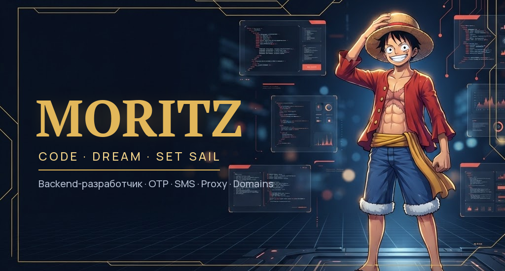

 
 

 

<table>
<tr>
<td width="64%" valign="top">

### Привет, я Moritz

Backend-разработчик. Собираю сервисы, у которых одна задача — работать надёжно: **одноразовые коды**, **SMS-уведомления**, **прокси-пулы** и **мониторинг доменов**.

Этот профиль — мой бортовой журнал. Каждый репозиторий здесь — отдельный остров на карте, а серия **Luffy** (SMS, Domains, Stars) — флагманский маршрут.

**Чем занимаюсь сейчас**

- Довожу серию Luffy до стабильных релизов и общего API.
- Пишу короткие статьи о том, как проектировать OTP и SMS без потерь.
- Собираю панель Luffy Stars, чтобы следить за проектами в одном месте.

**Как работаю**

- Сначала надёжность и логи, потом красота интерфейса.
- Небольшие коммиты и понятные названия.
- Документация — часть продукта, а не приложение к нему.

> Необязательно знать весь маршрут, чтобы отправиться в путь.

<a href="https://github.com/danielmanzuckerberg-tech?tab=repositories"><b>Все репозитории →</b></a> &nbsp;·&nbsp; <a href="https://github.com/danielmanzuckerberg-tech/danielmanzuckerberg-tech/blob/main/articles/otp-bez-oshibok.md"><b>Первая статья →</b></a>

</td>
<td width="36%" align="center" valign="middle">

</td>
</tr>
</table>

 
 

 

<table>
<tr>
<td width="50%" align="center" valign="top">

</td>
<td width="50%" align="center" valign="top">

</td>
</tr>
<tr>
<td width="50%" align="center" valign="top">

</td>
<td width="50%" align="center" valign="top">

</td>
</tr>
<tr>
<td width="50%" align="center" valign="top">

</td>
<td width="50%" align="center" valign="top">

</td>
</tr>
<tr>
<td width="50%" align="center" valign="top">

</td>
<td width="50%" align="center" valign="top">

</td>
</tr>
<tr>
<td width="50%" align="center" valign="top">

</td>
<td width="50%"></td></tr>
</table>

 
 

 
 

 
 

 
 

<b>Основные языки</b>

 

<b>Инструменты и платформы</b>

 

<b>Все языки мира — 407 в 16 группах.</b> Разверни группу — каждый значок ведёт на официальный сайт языка.

<b>Системные и низкоуровневые</b> · 32

 

<b>Веб, фронтенд и скриптовые</b> · 31

 

<b>JVM, .NET и корпоративные</b> · 24

 

<b>Мобильные и десктоп</b> · 14

 

<b>Функциональные</b> · 24

 

<b>Данные, наука и математика</b> · 23

 

<b>Запросы и базы данных</b> · 22

 

<b>GPU, шейдеры и железо</b> · 22

 

<b>Shell и автоматизация</b> · 22

 

<b>Конфигурация и инфраструктура</b> · 37

 

<b>Блокчейн и смарт-контракты</b> · 18

 

<b>Классика и история</b> · 29

 

<b>Игры и сценарные DSL</b> · 22

 

<b>Разметка, документы и шаблоны</b> · 30

 

<b>Учебные и эзотерические</b> · 25

 

<b>Молодые и нишевые</b> · 32

 

 

<table>
<tr>
<td width="50%" align="center" valign="top">

</td>
<td width="50%" align="center" valign="top">

</td>
</tr>
<tr>
<td width="50%" align="center" valign="top">

</td>
<td width="50%" align="center" valign="top">

</td>
</tr>
</table>

 

 
 

 
 

<b>One commit closer to the horizon.</b>

 
 

Moritz · <a href="https://github.com/danielmanzuckerberg-tech">@danielmanzuckerberg-tech</a> · Оформление вдохновлено One Piece · Неофициальный фан-дизайн

