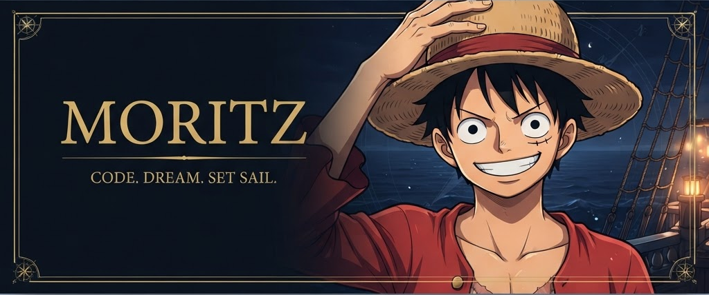
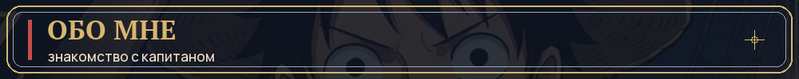
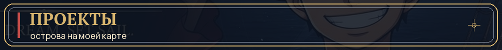
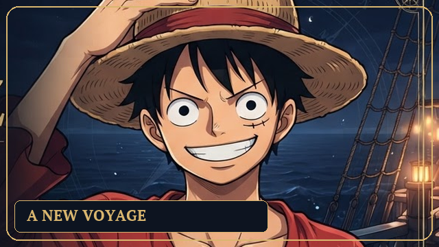
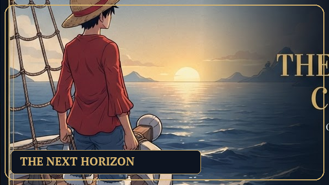
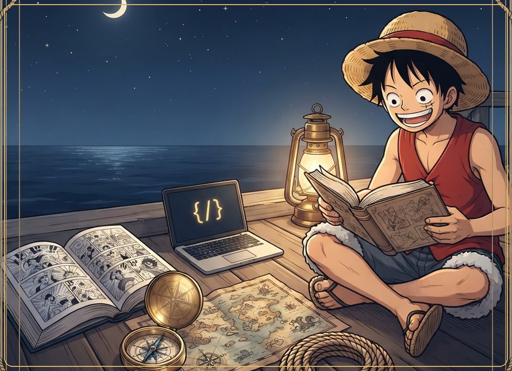
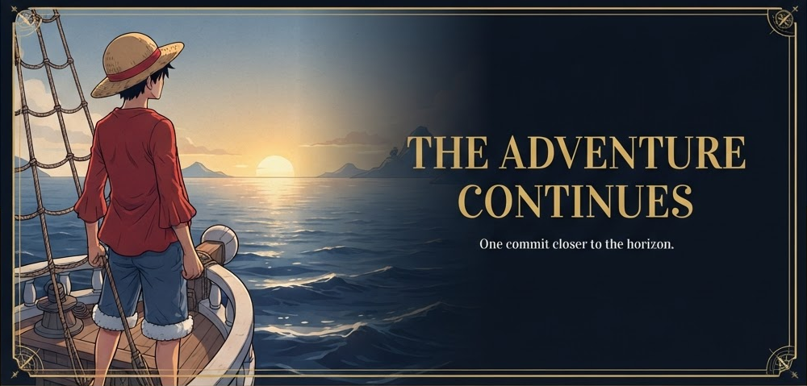

 
 

 
 

<em>Большие мечты. Свободный курс. Своя история.</em>

 
 

<a href="https://github.com/danielmanzuckerberg-tech"><b>Мой GitHub</b></a>
&nbsp; · &nbsp;
<a href="https://github.com/danielmanzuckerberg-tech?tab=repositories"><b>Все репозитории</b></a>
&nbsp; · &nbsp;
<a href="https://github.com/danielmanzuckerberg-tech/joy-kerry"><b>Marketplace</b></a>

 

<table>
<tr>
<td width="64%" valign="top">

### Привет, я Moritz

Добро пожаловать на борт моего GitHub.

Этот профиль — мой **бортовой журнал**: место для проектов, идей и новых открытий. Каждая новая задача — ещё один остров на карте.

Мне близок дух **Луффи**: не бояться неизвестного, ценить свою команду и не отказываться от большой мечты.

**Мой курс**

- Учиться через практику и собственные эксперименты.
- Превращать интересные идеи в работающие проекты.
- Двигаться вперёд — по одному коммиту за раз.

> Необязательно знать весь маршрут, чтобы отправиться в путь.

На GitHub — [@danielmanzuckerberg-tech](https://github.com/danielmanzuckerberg-tech).

</td>
<td width="36%" align="center" valign="middle">

</td>
</tr>
</table>

 

Каждый репозиторий — новая точка на карте.

<table>
<tr>
<td width="50%" align="center" valign="top">

### joy-kerry

**Luxury Digital Marketplace**

Архив проекта в формате ZIP. Все опубликованные материалы — в репозитории.

<code>Marketplace</code> <code>ZIP</code>

 
 

[Открыть репозиторий →](https://github.com/danielmanzuckerberg-tech/joy-kerry)

</td>
<td width="50%" align="center" valign="top">

### joyy

**Luxury Digital Marketplace**

Архив проекта в формате RAR. Ещё один способ познакомиться с материалами.

<code>Marketplace</code> <code>RAR</code>

 
 

[Открыть репозиторий →](https://github.com/danielmanzuckerberg-tech/joyy)

</td>
</tr>
</table>

<a href="https://github.com/danielmanzuckerberg-tech?tab=repositories"><b>Посмотреть все репозитории →</b></a>

 

### За пределами кода

- **One Piece** — приключения, свобода и большие мечты.
- **Идеи и эксперименты** — повод попробовать что-то новое.
- **Новые горизонты** — всегда есть чему научиться.

 

 
 

<b>One commit closer to the horizon.</b>

 
 

Moritz · Оформление вдохновлено One Piece · Неофициальный фан-дизайн

