<a href="https://github.com/danielmanzuckerberg-tech"><picture><source media="(max-width: 640px) and (prefers-reduced-motion: reduce)" srcset="./assets/hero-mobile-static.png" /><source media="(max-width: 640px)" srcset="./assets/hero-mobile.svg" /><source media="(prefers-reduced-motion: reduce)" srcset="./assets/hero-static.png" /></picture></a>

<a href="#about">Обо мне</a> &nbsp; / &nbsp; <a href="#projects">Проекты</a> &nbsp; / &nbsp; <a href="#stats">Активность</a> &nbsp; / &nbsp; <a href="#stack">Языки</a> &nbsp; / &nbsp; <a href="#lab">3D Lab</a> &nbsp; / &nbsp; <a href="#articles">Журнал</a> &nbsp; / &nbsp; <a href="#contact">На связи</a>

<h2><picture><source media="(max-width: 640px)" srcset="./assets/logbook-section-about-mobile.svg" /></picture></h2>

**Привет, я Moritz.** Занимаюсь backend-разработкой: API, одноразовые коды, сообщения, сетевые инструменты. Люблю системы, в которых сложное становится понятным.

Этот профиль — мой бортовой журнал. Здесь проекты, инженерные заметки и эксперименты, которые помогают двигаться дальше. В коде ценю надёжность, в работе — любопытство. А у Луффи учусь не терять из виду горизонт.

<picture><source media="(max-width: 640px)" srcset="./assets/principles-mobile.svg" /></picture>

<h2><picture><source media="(max-width: 640px)" srcset="./assets/logbook-section-projects-mobile.svg" /></picture></h2>

**Публичные проекты.** Репозитории, которые действительно доступны. Архивные сборки отмечены отдельно от исходного кода.

<!-- web:projects:start -->

<a href="https://github.com/danielmanzuckerberg-tech/danielmanzuckerberg-tech"><picture><source media="(max-width: 640px)" srcset="./assets/logbook-project-profile-mobile.svg" /></picture></a>

<a href="https://github.com/danielmanzuckerberg-tech/joy-kerry"><picture><source media="(max-width: 640px)" srcset="./assets/project-joy-kerry-mobile.svg" /></picture></a>

<a href="https://github.com/danielmanzuckerberg-tech/joyy"><picture><source media="(max-width: 640px)" srcset="./assets/project-joyy-mobile.svg" /></picture></a>

<h3>Семь идей в работе</h3>

Архитектурные концепты, а не запущенные публичные сервисы. Все карточки видны сразу; на отдельной странице каждого проекта — задача, устройство и критерии готовности.

<a href="./projects/alpha-otp.md"><picture><source media="(max-width: 640px)" srcset="./assets/project-alpha-otp-mobile.svg" /></picture></a>

<a href="./projects/alpha-otp.md">Alpha OTP · задача, архитектура и план →</a>

<a href="./projects/rdx-otp.md"><picture><source media="(max-width: 640px)" srcset="./assets/project-rdx-otp-mobile.svg" /></picture></a>

<a href="./projects/rdx-otp.md">RDX OTP · задача, архитектура и план →</a>

<a href="./projects/luffy-sms.md"><picture><source media="(max-width: 640px)" srcset="./assets/project-luffy-sms-mobile.svg" /></picture></a>

<a href="./projects/luffy-sms.md">Luffy SMS · задача, архитектура и план →</a>

<a href="./projects/note-sms.md"><picture><source media="(max-width: 640px)" srcset="./assets/project-note-sms-mobile.svg" /></picture></a>

<a href="./projects/note-sms.md">Note SMS · задача, архитектура и план →</a>

<a href="./projects/nice-proxy.md"><picture><source media="(max-width: 640px)" srcset="./assets/project-nice-proxy-mobile.svg" /></picture></a>

<a href="./projects/nice-proxy.md">Nice Proxy · задача, архитектура и план →</a>

<a href="./projects/luffy-domains.md"><picture><source media="(max-width: 640px)" srcset="./assets/project-luffy-domains-mobile.svg" /></picture></a>

<a href="./projects/luffy-domains.md">Luffy Domains · задача, архитектура и план →</a>

<a href="./projects/luffy-stars.md"><picture><source media="(max-width: 640px)" srcset="./assets/project-luffy-stars-mobile.svg" /></picture></a>

<a href="./projects/luffy-stars.md">Luffy Stars · задача, архитектура и план →</a>

<!-- web:projects:end -->

<a href="https://github.com/danielmanzuckerberg-tech?tab=repositories"><b>Все публичные репозитории →</b></a> &nbsp; · &nbsp; <a href="./models/moritz-compass.stl">3D-компас →</a>

<h2><picture><source media="(max-width: 640px)" srcset="./assets/logbook-section-stats-mobile.svg" /></picture></h2>

Снимок настоящего календаря GitHub. Обновлено **2026-09-18**. Вклады включают разные виды активности и не равны количеству коммитов; крайние месяцы неполные.

<!-- web:activity:start -->

<a href="https://github.com/danielmanzuckerberg-tech?tab=overview"><picture><source media="(max-width: 640px)" srcset="./assets/logbook-activity-mobile.svg" /></picture></a>

<a href="https://github.com/danielmanzuckerberg-tech?tab=overview"><picture><source media="(max-width: 640px)" srcset="./assets/logbook-calendar-mobile.svg" />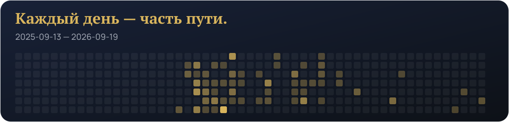</picture></a>

<h3>Вклады по месяцам</h3>
<table><thead><tr><th>Месяц</th><th>Вклады</th></tr></thead><tbody><tr><td>2025-09</td><td>0</td></tr><tr><td>2025-10</td><td>0</td></tr><tr><td>2025-11</td><td>0</td></tr><tr><td>2025-12</td><td>0</td></tr><tr><td>2026-01</td><td>30</td></tr><tr><td>2026-02</td><td>356</td></tr><tr><td>2026-03</td><td>112</td></tr><tr><td>2026-04</td><td>98</td></tr><tr><td>2026-05</td><td>70</td></tr><tr><td>2026-06</td><td>15</td></tr><tr><td>2026-07</td><td>26</td></tr><tr><td>2026-08</td><td>1</td></tr><tr><td>2026-09</td><td>12</td></tr></tbody></table>
<!-- web:activity:end -->

<a href="https://github.com/danielmanzuckerberg-tech?tab=overview">Проверить актуальные данные на GitHub →</a>

<h2><picture><source media="(max-width: 640px)" srcset="./assets/logbook-section-stack-mobile.svg" /></picture></h2>

**Инструмент под задачу, а не задача под инструмент.** Технологии для разработки и каталог языков для изучения — разные вещи. У каждой записи есть иконка и название.

<h3>Инструменты и платформы</h3>

<h4>Языки и основы · 10</h4>

<a href="https://www.typescriptlang.org">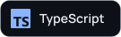</a>
<a href="https://developer.mozilla.org/docs/Web/JavaScript">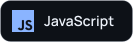</a>
<a href="https://www.python.org">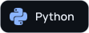</a>

<a href="https://dev.java">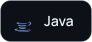</a>
<a href="https://learn.microsoft.com/dotnet/csharp/">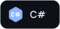</a>

<h4>Веб и интерфейсы · 8</h4>

<a href="https://react.dev">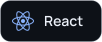</a>
<a href="https://nextjs.org">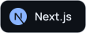</a>

<a href="https://developer.mozilla.org/docs/Web/CSS">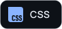</a>

<h4>Backend и API · 8</h4>

<a href="https://nodejs.org">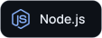</a>

<a href="https://graphql.org">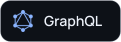</a>

<h4>Данные и хранение · 7</h4>

<h4>Инфраструктура и инструменты · 13</h4>

<a href="https://www.figma.com">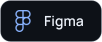</a>

<a href="./catalog/languages.csv"><picture><source media="(max-width: 640px)" srcset="./assets/logbook-atlas-mobile.svg" /></picture></a>

<picture><source media="(max-width: 640px)" srcset="./assets/logbook-catalogue-chart-mobile.svg" /></picture>

<h3>Авторская подборка · 407 названий / 16 направлений</h3>

Современные, исторические, специализированные и экспериментальные языки. Все направления раскрыты. Это каталог для изучения, а не заявление о владении каждым из них.

<h4>Системные и низкоуровневые · 32</h4>

<a href="https://ada-lang.io">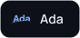</a>

<a href="https://developer.arm.com/documentation">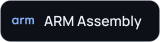</a>

<h4>Веб, фронтенд и скриптовые · 31</h4>

<a href="https://coffeescript.org">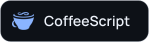</a>
<a href="https://livescript.net">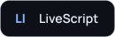</a>
<a href="https://civet.dev">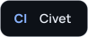</a>

<a href="https://www.purescript.org">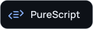</a>

<a href="https://www.assemblyscript.org">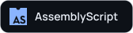</a>

<h4>JVM, .NET и корпоративные · 24</h4>

<h4>Мобильные и десктоп · 14</h4>

<a href="https://www.swift.org">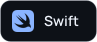</a>

<a href="https://en.wikipedia.org/wiki/Objective-C#Objective-C++">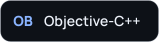</a>

<a href="https://reactnative.dev">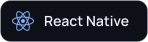</a>

<a href="https://vala.dev">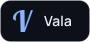</a>

<a href="https://www.electronjs.org">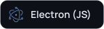</a>

<h4>Функциональные · 24</h4>

<a href="https://rocq-prover.org">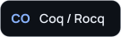</a>
<a href="https://lean-lang.org">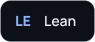</a>

<a href="https://en.wikipedia.org/wiki/Clean_(programming_language)">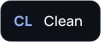</a>

<h4>Данные, наука и математика · 23</h4>

<a href="https://www.maplesoft.com/products/maple/">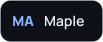</a>

<a href="https://www.scilab.org">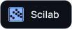</a>

<a href="https://aplwiki.com">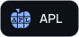</a>

<a href="https://code.kx.com/q/">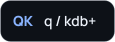</a>

<a href="https://en.wikipedia.org/wiki/Nial">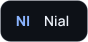</a>

<h4>Запросы и базы данных · 22</h4>

<h4>GPU, шейдеры и железо · 22</h4>

<a href="https://en.wikipedia.org/wiki/Bluespec,_Inc.">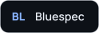</a>

<a href="https://www.arduino.cc/reference/en/">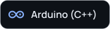</a>

<h4>Shell и автоматизация · 22</h4>

<a href="https://www.zsh.org">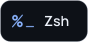</a>
<a href="https://fishshell.com">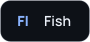</a>

<h4>Конфигурация и инфраструктура · 37</h4>

<a href="https://toml.io">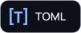</a>

<a href="https://cuelang.org">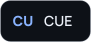</a>

<a href="https://ninja-build.org">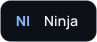</a>

<a href="https://thrift.apache.org">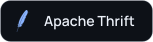</a>
<a href="https://www.openapis.org">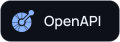</a>

<h4>Блокчейн и смарт-контракты · 18</h4>

<a href="https://soliditylang.org">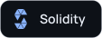</a>

<h4>Классика и история · 29</h4>

<h4>Игры и сценарные DSL · 22</h4>

<h4>Разметка, документы и шаблоны · 30</h4>

<h4>Учебные и эзотерические · 25</h4>

<h4>Молодые и нишевые · 32</h4>

<h3>Полный каталог · 1011 записей</h3>

<a href="./catalog/languages.csv"><b>Открыть весь каталог с поиском →</b></a>

Включены все 835 записей из зафиксированной версии GitHub Linguist и дополнительные названия из авторской подборки. Здесь есть языки программирования, разметка, форматы данных и текст. Это не буквально все когда-либо созданные языки и не перечень освоенных навыков.

<a href="https://github.com/github-linguist/linguist/blob/ee4fb24d13cb21a0eb43b30b52f5cde17fbba8ae/lib/linguist/languages.yml">GitHub Linguist, версия ee4fb24</a> · <a href="./assets/linguist-LICENSE.txt">Лицензия MIT</a>

Брендовые знаки — theSVG.org; права принадлежат владельцам. У языков без доступного знака — нейтральная монограмма, не выдуманный логотип.

<h2><picture><source media="(max-width: 640px)" srcset="./assets/logbook-section-lab-mobile.svg" /></picture></h2>

Маленький объект с большим смыслом. Стальной корпус, графитовый циферблат и голубая ось. Напоминание: важен не только темп, но и направление.

<a href="./models/moritz-compass.stl"><picture><source media="(max-width: 640px)" srcset="./assets/logbook-lab-mobile.svg" /></picture></a>

<a href="./models/moritz-compass.stl"><b>Вращать 3D-модель на GitHub →</b></a> &nbsp; · &nbsp; <a href="./projects/moritz-compass.md">Как устроен эксперимент →</a>

SVG-графика видна сразу, без JavaScript и раскрывающихся блоков. Вращение 3D-модели открывается отдельно: GitHub не исполняет WebGL внутри README. Анимации в веб-версии учитывают настройку уменьшения движения.

<h2><picture><source media="(max-width: 640px)" srcset="./assets/logbook-section-articles-mobile.svg" /></picture></h2>

**10 заметок о ремесле.** Архитектура, надёжность, безопасность и внимание к деталям. Без выдуманных кейсов и обещаний универсальных рецептов.

<!-- web:articles:start -->

<a href="./articles/idempotentnost-api.md"><picture><source media="(max-width: 640px)" srcset="./assets/logbook-article-idempotentnost-api-mobile.svg" /></picture></a>

<a href="./articles/retry-backoff.md"><picture><source media="(max-width: 640px)" srcset="./assets/logbook-article-retry-backoff-mobile.svg" /></picture></a>

<a href="./articles/postgres-indexes.md"><picture><source media="(max-width: 640px)" srcset="./assets/logbook-article-postgres-indexes-mobile.svg" /></picture></a>

<a href="./articles/motion-with-care.md"><picture><source media="(max-width: 640px)" srcset="./assets/logbook-article-motion-with-care-mobile.svg" /></picture></a>

<a href="./articles/webhook-signatures.md"><picture><source media="(max-width: 640px)" srcset="./assets/logbook-article-webhook-signatures-mobile.svg" /></picture></a>

<a href="./articles/observability-api.md"><picture><source media="(max-width: 640px)" srcset="./assets/logbook-article-observability-api-mobile.svg" /></picture></a>

<a href="./articles/otp-bez-oshibok.md"><picture><source media="(max-width: 640px)" srcset="./assets/article-otp-bez-oshibok-mobile.svg" /></picture></a>

<a href="./articles/sms-servis-kotoryj-ne-teryaet-soobscheniya.md"><picture><source media="(max-width: 640px)" srcset="./assets/article-sms-servis-kotoryj-ne-teryaet-soobscheniya-mobile.svg" /></picture></a>

<a href="./articles/proxy-dlya-razrabotchika.md"><picture><source media="(max-width: 640px)" srcset="./assets/article-proxy-dlya-razrabotchika-mobile.svg" /></picture></a>

<a href="./articles/monitoring-domenov.md"><picture><source media="(max-width: 640px)" srcset="./assets/article-monitoring-domenov-mobile.svg" /></picture></a>

<!-- web:articles:end -->

<h2><picture><source media="(max-width: 640px)" srcset="./assets/logbook-section-contact-mobile.svg" /></picture></h2>

<a href="https://github.com/danielmanzuckerberg-tech/danielmanzuckerberg-tech/issues/new"><picture><source media="(max-width: 640px)" srcset="./assets/contact-mobile.svg" /></picture></a>

<a href="https://github.com/danielmanzuckerberg-tech">GitHub</a> &nbsp; / &nbsp; <a href="https://github.com/danielmanzuckerberg-tech?tab=repositories">Репозитории</a> &nbsp; / &nbsp; <a href="./articles/otp-bez-oshibok.md">Журнал</a> &nbsp; / &nbsp; <a href="#about">Наверх ↑</a>

MORITZ / DEVELOPER Code. Dream. Set sail. One Piece inspired. Неофициальный фан-дизайн.

