<a href="https://github.com/danielmanzuckerberg-tech"><picture><source media="(max-width: 640px) and (prefers-reduced-motion: reduce)" srcset="./assets/hero-mobile-static.png" /><source media="(max-width: 640px)" srcset="./assets/hero-mobile.svg" /><source media="(prefers-reduced-motion: reduce)" srcset="./assets/hero-static.png" /></picture></a>

<a href="#about">Обо мне</a> &nbsp; / &nbsp; <a href="#projects">Проекты</a> &nbsp; / &nbsp; <a href="#stack">Стек</a> &nbsp; / &nbsp; <a href="#articles">Заметки</a> &nbsp; / &nbsp; <a href="#contact">На связи</a>

<h2><picture><source media="(max-width: 640px)" srcset="./assets/section-about-mobile.svg" /></picture></h2>

**Привет, я Moritz.** Занимаюсь backend-разработкой: API, одноразовые коды, сообщения, сетевые инструменты. Люблю системы, в которых сложное становится понятным.

Этот профиль — мой журнал проектов и экспериментов. В коде ценю надёжность, в работе — любопытство. А у Луффи учусь не терять из виду горизонт.

<picture><source media="(max-width: 640px)" srcset="./assets/principles-mobile.svg" /></picture>

<h2><picture><source media="(max-width: 640px)" srcset="./assets/section-projects-mobile.svg" /></picture></h2>

Публичные материалы и сборки, которыми можно поделиться.

<a href="https://github.com/danielmanzuckerberg-tech/joy-kerry"><picture><source media="(max-width: 640px)" srcset="./assets/project-joy-kerry-mobile.svg" /></picture></a>

<a href="https://github.com/danielmanzuckerberg-tech/joyy"><picture><source media="(max-width: 640px)" srcset="./assets/project-joyy-mobile.svg" />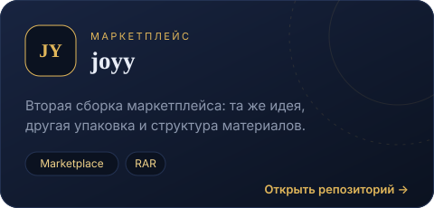</picture></a>

<b>Сервисы и эксперименты</b> · ещё 7 направлений

OTP, сообщения, сеть и инструменты разработчика. Для названий без доступного публичного репозитория ссылки открывают поиск в моих репозиториях.

<a href="https://github.com/danielmanzuckerberg-tech?tab=repositories&amp;q=luffy-sms"><picture><source media="(max-width: 640px)" srcset="./assets/project-luffy-sms-mobile.svg" /></picture></a>

<a href="https://github.com/danielmanzuckerberg-tech?tab=repositories&amp;q=alpha-otp"><picture><source media="(max-width: 640px)" srcset="./assets/project-alpha-otp-mobile.svg" />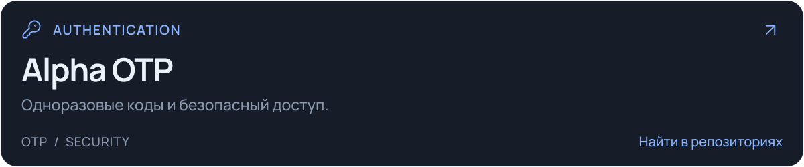</picture></a>

<a href="https://github.com/danielmanzuckerberg-tech?tab=repositories&amp;q=rdx-otp"><picture><source media="(max-width: 640px)" srcset="./assets/project-rdx-otp-mobile.svg" />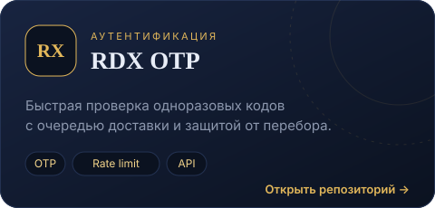</picture></a>

<a href="https://github.com/danielmanzuckerberg-tech?tab=repositories&amp;q=note-sms"><picture><source media="(max-width: 640px)" srcset="./assets/project-note-sms-mobile.svg" />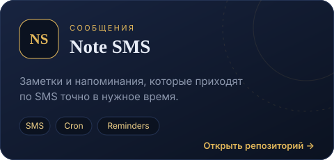</picture></a>

<a href="https://github.com/danielmanzuckerberg-tech?tab=repositories&amp;q=nice-proxy"><picture><source media="(max-width: 640px)" srcset="./assets/project-nice-proxy-mobile.svg" />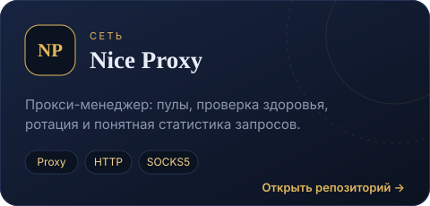</picture></a>

<a href="https://github.com/danielmanzuckerberg-tech?tab=repositories&amp;q=luffy-domains"><picture><source media="(max-width: 640px)" srcset="./assets/project-luffy-domains-mobile.svg" />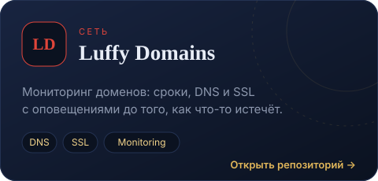</picture></a>

<a href="https://github.com/danielmanzuckerberg-tech?tab=repositories&amp;q=luffy-stars"><picture><source media="(max-width: 640px)" srcset="./assets/project-luffy-stars-mobile.svg" />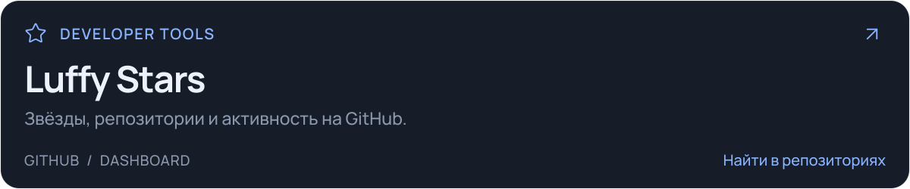</picture></a>

<a href="https://github.com/danielmanzuckerberg-tech?tab=repositories"><b>Все репозитории →</b></a>

<h2><picture><source media="(max-width: 640px)" srcset="./assets/section-stack-mobile.svg" /></picture></h2>

Инструмент под задачу, а не задача под инструмент.

<picture><source media="(max-width: 640px)" srcset="./assets/toolbox-mobile.svg" /></picture>

<b>Большой каталог языков</b> · 407 названий / 16 групп

Полная подборка из моего стека: современные, исторические, специализированные и экспериментальные языки. Это каталог для изучения, а не заявление о владении каждым из них. Ссылки ведут на документацию, сайты проектов и справочные страницы.

<b>Системные и низкоуровневые</b> · 32

<a href="https://en.wikipedia.org/wiki/C_(programming_language)">C</a> &nbsp;·&nbsp; <a href="https://isocpp.org">C++</a> &nbsp;·&nbsp; <a href="https://www.rust-lang.org">Rust</a> &nbsp;·&nbsp; <a href="https://go.dev">Go</a> &nbsp;·&nbsp; <a href="https://ziglang.org">Zig</a> &nbsp;·&nbsp; <a href="https://dlang.org">D</a> &nbsp;·&nbsp; <a href="https://nim-lang.org">Nim</a> &nbsp;·&nbsp; <a href="https://crystal-lang.org">Crystal</a> &nbsp;·&nbsp; <a href="https://vlang.io">V</a> &nbsp;·&nbsp; <a href="https://odin-lang.org">Odin</a> &nbsp;·&nbsp; <a href="https://github.com/carbon-language/carbon-lang">Carbon</a> &nbsp;·&nbsp; <a href="https://en.wikipedia.org/wiki/Jonathan_Blow">Jai</a> &nbsp;·&nbsp; <a href="https://harelang.org">Hare</a> &nbsp;·&nbsp; <a href="https://c3-lang.org">C3</a> &nbsp;·&nbsp; <a href="https://vale.dev">Vale</a> &nbsp;·&nbsp; <a href="https://ada-lang.io">Ada</a> &nbsp;·&nbsp; <a href="https://en.wikipedia.org/wiki/SPARK_(programming_language)">SPARK</a> &nbsp;·&nbsp; <a href="https://fortran-lang.org">Fortran</a> &nbsp;·&nbsp; <a href="https://en.wikipedia.org/wiki/Pascal_(programming_language)">Pascal</a> &nbsp;·&nbsp; <a href="https://www.freepascal.org">Object Pascal</a> &nbsp;·&nbsp; <a href="https://www.embarcadero.com/products/delphi">Delphi</a> &nbsp;·&nbsp; <a href="https://en.wikipedia.org/wiki/X86_assembly_language">Assembly x86</a> &nbsp;·&nbsp; <a href="https://developer.arm.com/documentation">ARM Assembly</a> &nbsp;·&nbsp; <a href="https://riscv.org">RISC-V Assembly</a> &nbsp;·&nbsp; <a href="https://webassembly.github.io/spec/core/text/index.html">WebAssembly Text</a> &nbsp;·&nbsp; <a href="https://en.wikipedia.org/wiki/Modula-2">Modula-2</a> &nbsp;·&nbsp; <a href="https://en.wikipedia.org/wiki/Modula-3">Modula-3</a> &nbsp;·&nbsp; <a href="https://en.wikipedia.org/wiki/Oberon_(programming_language)">Oberon</a> &nbsp;·&nbsp; <a href="https://en.wikipedia.org/wiki/COBOL">COBOL</a> &nbsp;·&nbsp; <a href="https://en.wikipedia.org/wiki/PL/I">PL/I</a> &nbsp;·&nbsp; <a href="https://en.wikipedia.org/wiki/IBM_RPG">RPG</a> &nbsp;·&nbsp; <a href="https://en.wikipedia.org/wiki/Cyclone_(programming_language)">Cyclone</a>

<b>Веб, фронтенд и скриптовые</b> · 31

<a href="https://developer.mozilla.org/docs/Web/JavaScript">JavaScript</a> &nbsp;·&nbsp; <a href="https://www.typescriptlang.org">TypeScript</a> &nbsp;·&nbsp; <a href="https://www.python.org">Python</a> &nbsp;·&nbsp; <a href="https://www.php.net">PHP</a> &nbsp;·&nbsp; <a href="https://www.ruby-lang.org">Ruby</a> &nbsp;·&nbsp; <a href="https://www.perl.org">Perl</a> &nbsp;·&nbsp; <a href="https://raku.org">Raku</a> &nbsp;·&nbsp; <a href="https://www.lua.org">Lua</a> &nbsp;·&nbsp; <a href="https://coffeescript.org">CoffeeScript</a> &nbsp;·&nbsp; <a href="https://livescript.net">LiveScript</a> &nbsp;·&nbsp; <a href="https://civet.dev">Civet</a> &nbsp;·&nbsp; <a href="https://dart.dev">Dart</a> &nbsp;·&nbsp; <a href="https://elm-lang.org">Elm</a> &nbsp;·&nbsp; <a href="https://www.purescript.org">PureScript</a> &nbsp;·&nbsp; <a href="https://rescript-lang.org">ReScript</a> &nbsp;·&nbsp; <a href="https://reasonml.github.io">Reason</a> &nbsp;·&nbsp; <a href="https://hacklang.org">Hack</a> &nbsp;·&nbsp; <a href="https://haxe.org">Haxe</a> &nbsp;·&nbsp; <a href="https://imba.io">Imba</a> &nbsp;·&nbsp; <a href="https://webassembly.org">WebAssembly</a> &nbsp;·&nbsp; <a href="https://www.assemblyscript.org">AssemblyScript</a> &nbsp;·&nbsp; <a href="https://developer.mozilla.org/docs/Web/HTML">HTML</a> &nbsp;·&nbsp; <a href="https://developer.mozilla.org/docs/Web/CSS">CSS</a> &nbsp;·&nbsp; <a href="https://sass-lang.com">Sass</a> &nbsp;·&nbsp; <a href="https://lesscss.org">Less</a> &nbsp;·&nbsp; <a href="https://stylus-lang.com">Stylus</a> &nbsp;·&nbsp; <a href="https://developer.mozilla.org/docs/Web/SVG">SVG</a> &nbsp;·&nbsp; <a href="https://react.dev/learn/writing-markup-with-jsx">JSX</a> &nbsp;·&nbsp; <a href="https://svelte.dev">Svelte</a> &nbsp;·&nbsp; <a href="https://vuejs.org/guide/scaling-up/sfc.html">Vue SFC</a> &nbsp;·&nbsp; <a href="https://astro.build">Astro</a>

<b>JVM, .NET и корпоративные</b> · 24

<a href="https://dev.java">Java</a> &nbsp;·&nbsp; <a href="https://kotlinlang.org">Kotlin</a> &nbsp;·&nbsp; <a href="https://www.scala-lang.org">Scala</a> &nbsp;·&nbsp; <a href="https://groovy-lang.org">Groovy</a> &nbsp;·&nbsp; <a href="https://clojure.org">Clojure</a> &nbsp;·&nbsp; <a href="https://en.wikipedia.org/wiki/Ceylon_(programming_language)">Ceylon</a> &nbsp;·&nbsp; <a href="https://eclipse.dev/Xtext/xtend/">Xtend</a> &nbsp;·&nbsp; <a href="https://fantom.org">Fantom</a> &nbsp;·&nbsp; <a href="https://github.com/Frege/frege">Frege</a> &nbsp;·&nbsp; <a href="https://www.jython.org">Jython</a> &nbsp;·&nbsp; <a href="https://www.jruby.org">JRuby</a> &nbsp;·&nbsp; <a href="https://learn.microsoft.com/dotnet/csharp/">C#</a> &nbsp;·&nbsp; <a href="https://fsharp.org">F#</a> &nbsp;·&nbsp; <a href="https://learn.microsoft.com/dotnet/visual-basic/">Visual Basic .NET</a> &nbsp;·&nbsp; <a href="https://learn.microsoft.com/powershell/">PowerShell</a> &nbsp;·&nbsp; <a href="https://ironpython.net">IronPython</a> &nbsp;·&nbsp; <a href="https://en.wikipedia.org/wiki/Nemerle">Nemerle</a> &nbsp;·&nbsp; <a href="https://en.wikipedia.org/wiki/Boo_(programming_language)">Boo</a> &nbsp;·&nbsp; <a href="https://www.elementscompiler.com/elements/oxygene/">Oxygene</a> &nbsp;·&nbsp; <a href="https://community.sap.com/topics/abap">ABAP</a> &nbsp;·&nbsp; <a href="https://developer.salesforce.com/docs/atlas.en-us.apexcode.meta/apexcode/">Apex</a> &nbsp;·&nbsp; <a href="https://en.wikipedia.org/wiki/PeopleCode">PeopleCode</a> &nbsp;·&nbsp; <a href="https://learn.microsoft.com/dynamics365/fin-ops-core/dev-itpro/dev-ref/xpp-language-reference">X++</a> &nbsp;·&nbsp; <a href="https://en.wikipedia.org/wiki/OpenEdge_Advanced_Business_Language">Progress 4GL</a>

<b>Мобильные и десктоп</b> · 14

<a href="https://www.swift.org">Swift</a> &nbsp;·&nbsp; <a href="https://en.wikipedia.org/wiki/Objective-C">Objective-C</a> &nbsp;·&nbsp; <a href="https://en.wikipedia.org/wiki/Objective-C#Objective-C++">Objective-C++</a> &nbsp;·&nbsp; <a href="https://kotlinlang.org/docs/multiplatform.html">Kotlin Multiplatform</a> &nbsp;·&nbsp; <a href="https://flutter.dev">Dart / Flutter</a> &nbsp;·&nbsp; <a href="https://reactnative.dev">React Native</a> &nbsp;·&nbsp; <a href="https://doc.qt.io/qt-6/qmlapplications.html">QML</a> &nbsp;·&nbsp; <a href="https://vala.dev">Vala</a> &nbsp;·&nbsp; <a href="https://en.wikipedia.org/wiki/Genie_(programming_language)">Genie</a> &nbsp;·&nbsp; <a href="https://developer.apple.com/library/archive/documentation/AppleScript/Conceptual/AppleScriptLangGuide/introduction/ASLR_intro.html">AppleScript</a> &nbsp;·&nbsp; <a href="https://en.wikipedia.org/wiki/JavaScript_for_Automation">JavaScript for Automation</a> &nbsp;·&nbsp; <a href="https://www.tcl-lang.org">Tcl/Tk</a> &nbsp;·&nbsp; <a href="https://www.electronjs.org">Electron (JS)</a> &nbsp;·&nbsp; <a href="https://tauri.app">Tauri (Rust)</a>

<b>Функциональные</b> · 24

<a href="https://www.haskell.org">Haskell</a> &nbsp;·&nbsp; <a href="https://ocaml.org">OCaml</a> &nbsp;·&nbsp; <a href="https://en.wikipedia.org/wiki/Standard_ML">Standard ML</a> &nbsp;·&nbsp; <a href="https://www.erlang.org">Erlang</a> &nbsp;·&nbsp; <a href="https://elixir-lang.org">Elixir</a> &nbsp;·&nbsp; <a href="https://gleam.run">Gleam</a> &nbsp;·&nbsp; <a href="https://lfe.io">LFE</a> &nbsp;·&nbsp; <a href="https://www.scheme.org">Scheme</a> &nbsp;·&nbsp; <a href="https://racket-lang.org">Racket</a> &nbsp;·&nbsp; <a href="https://www.gnu.org/software/guile/">Guile</a> &nbsp;·&nbsp; <a href="https://lisp-lang.org">Common Lisp</a> &nbsp;·&nbsp; <a href="https://www.idris-lang.org">Idris</a> &nbsp;·&nbsp; <a href="https://wiki.portal.chalmers.se/agda/pmwiki.php">Agda</a> &nbsp;·&nbsp; <a href="https://rocq-prover.org">Coq / Rocq</a> &nbsp;·&nbsp; <a href="https://lean-lang.org">Lean</a> &nbsp;·&nbsp; <a href="https://isabelle.in.tum.de">Isabelle</a> &nbsp;·&nbsp; <a href="https://www.unison-lang.org">Unison</a> &nbsp;·&nbsp; <a href="https://www.roc-lang.org">Roc</a> &nbsp;·&nbsp; <a href="https://koka-lang.github.io/koka/doc/index.html">Koka</a> &nbsp;·&nbsp; <a href="https://en.wikipedia.org/wiki/Miranda_(programming_language)">Miranda</a> &nbsp;·&nbsp; <a href="https://en.wikipedia.org/wiki/Clean_(programming_language)">Clean</a> &nbsp;·&nbsp; <a href="https://en.wikipedia.org/wiki/Curry_(programming_language)">Curry</a> &nbsp;·&nbsp; <a href="https://en.wikipedia.org/wiki/Mercury_(programming_language)">Mercury</a> &nbsp;·&nbsp; <a href="https://futhark-lang.org">Futhark</a>

<b>Данные, наука и математика</b> · 23

<a href="https://www.r-project.org">R</a> &nbsp;·&nbsp; <a href="https://julialang.org">Julia</a> &nbsp;·&nbsp; <a href="https://www.mathworks.com/products/matlab.html">MATLAB</a> &nbsp;·&nbsp; <a href="https://octave.org">GNU Octave</a> &nbsp;·&nbsp; <a href="https://www.wolfram.com/language/">Wolfram Language</a> &nbsp;·&nbsp; <a href="https://www.sas.com">SAS</a> &nbsp;·&nbsp; <a href="https://www.stata.com">Stata</a> &nbsp;·&nbsp; <a href="https://en.wikipedia.org/wiki/SPSS">SPSS Syntax</a> &nbsp;·&nbsp; <a href="https://www.modular.com/mojo">Mojo</a> &nbsp;·&nbsp; <a href="https://www.maplesoft.com/products/maple/">Maple</a> &nbsp;·&nbsp; <a href="https://maxima.sourceforge.io">Maxima</a> &nbsp;·&nbsp; <a href="https://www.ni.com/labview">LabVIEW G</a> &nbsp;·&nbsp; <a href="https://en.wikipedia.org/wiki/IDL_(programming_language)">IDL</a> &nbsp;·&nbsp; <a href="https://www.scilab.org">Scilab</a> &nbsp;·&nbsp; <a href="https://en.wikipedia.org/wiki/GAUSS_(software)">GAUSS</a> &nbsp;·&nbsp; <a href="https://aplwiki.com">APL</a> &nbsp;·&nbsp; <a href="https://www.jsoftware.com">J</a> &nbsp;·&nbsp; <a href="https://en.wikipedia.org/wiki/K_(programming_language)">K</a> &nbsp;·&nbsp; <a href="https://code.kx.com/q/">q / kdb+</a> &nbsp;·&nbsp; <a href="https://mlochbaum.github.io/BQN/">BQN</a> &nbsp;·&nbsp; <a href="https://en.wikipedia.org/wiki/Nial">Nial</a> &nbsp;·&nbsp; <a href="https://mc-stan.org">Stan</a> &nbsp;·&nbsp; <a href="https://jupyter.org">Jupyter Notebook</a>

<b>Запросы и базы данных</b> · 22

<a href="https://en.wikipedia.org/wiki/SQL">SQL</a> &nbsp;·&nbsp; <a href="https://www.postgresql.org/docs/current/plpgsql.html">PL/pgSQL</a> &nbsp;·&nbsp; <a href="https://www.oracle.com/database/technologies/appdev/plsql.html">PL/SQL</a> &nbsp;·&nbsp; <a href="https://learn.microsoft.com/sql/t-sql/language-reference">T-SQL</a> &nbsp;·&nbsp; <a href="https://dev.mysql.com/doc/">MySQL SQL</a> &nbsp;·&nbsp; <a href="https://www.sqlite.org/lang.html">SQLite SQL</a> &nbsp;·&nbsp; <a href="https://graphql.org">GraphQL</a> &nbsp;·&nbsp; <a href="https://www.w3.org/TR/sparql11-query/">SPARQL</a> &nbsp;·&nbsp; <a href="https://neo4j.com/docs/cypher-manual/current/">Cypher</a> &nbsp;·&nbsp; <a href="https://tinkerpop.apache.org/gremlin.html">Gremlin</a> &nbsp;·&nbsp; <a href="https://hive.apache.org">HiveQL</a> &nbsp;·&nbsp; <a href="https://learn.microsoft.com/kusto/query/">KQL</a> &nbsp;·&nbsp; <a href="https://en.wikipedia.org/wiki/MultiDimensional_eXpressions">MDX (OLAP)</a> &nbsp;·&nbsp; <a href="https://en.wikipedia.org/wiki/Datalog">Datalog</a> &nbsp;·&nbsp; <a href="https://prql-lang.org">PRQL</a> &nbsp;·&nbsp; <a href="https://www.mongodb.com/docs/manual/tutorial/query-documents/">MongoDB Query</a> &nbsp;·&nbsp; <a href="https://redis.io/docs/latest/commands/">Redis commands</a> &nbsp;·&nbsp; <a href="https://www.elastic.co/guide/en/elasticsearch/reference/current/query-dsl.html">Elasticsearch DSL</a> &nbsp;·&nbsp; <a href="https://prometheus.io/docs/prometheus/latest/querying/basics/">PromQL</a> &nbsp;·&nbsp; <a href="https://grafana.com/docs/loki/latest/query/">LogQL</a> &nbsp;·&nbsp; <a href="https://jqlang.github.io/jq/">jq</a> &nbsp;·&nbsp; <a href="https://www.w3.org/TR/xpath-31/">XPath / XQuery</a>

<b>GPU, шейдеры и железо</b> · 22

<a href="https://developer.nvidia.com/cuda-toolkit">CUDA</a> &nbsp;·&nbsp; <a href="https://www.khronos.org/opencl/">OpenCL</a> &nbsp;·&nbsp; <a href="https://www.khronos.org/opengl/wiki/OpenGL_Shading_Language">GLSL</a> &nbsp;·&nbsp; <a href="https://learn.microsoft.com/windows/win32/direct3dhlsl/dx-graphics-hlsl">HLSL</a> &nbsp;·&nbsp; <a href="https://www.w3.org/TR/WGSL/">WGSL</a> &nbsp;·&nbsp; <a href="https://developer.apple.com/metal/">Metal Shading Language</a> &nbsp;·&nbsp; <a href="https://www.khronos.org/spir/">SPIR-V</a> &nbsp;·&nbsp; <a href="https://shader-slang.org">Slang</a> &nbsp;·&nbsp; <a href="https://en.wikipedia.org/wiki/Verilog">Verilog</a> &nbsp;·&nbsp; <a href="https://en.wikipedia.org/wiki/SystemVerilog">SystemVerilog</a> &nbsp;·&nbsp; <a href="https://en.wikipedia.org/wiki/VHDL">VHDL</a> &nbsp;·&nbsp; <a href="https://www.chisel-lang.org">Chisel</a> &nbsp;·&nbsp; <a href="https://en.wikipedia.org/wiki/Bluespec,_Inc.">Bluespec</a> &nbsp;·&nbsp; <a href="https://amaranth-lang.org">Amaranth HDL</a> &nbsp;·&nbsp; <a href="https://www.arduino.cc/reference/en/">Arduino (C++)</a> &nbsp;·&nbsp; <a href="https://micropython.org">MicroPython</a> &nbsp;·&nbsp; <a href="https://circuitpython.org">CircuitPython</a> &nbsp;·&nbsp; <a href="https://tinygo.org">TinyGo</a> &nbsp;·&nbsp; <a href="https://www.rust-lang.org/what/embedded">Embedded Rust</a> &nbsp;·&nbsp; <a href="https://en.wikipedia.org/wiki/Ladder_logic">Ladder Logic</a> &nbsp;·&nbsp; <a href="https://en.wikipedia.org/wiki/Structured_text">Structured Text (IEC 61131-3)</a> &nbsp;·&nbsp; <a href="https://en.wikipedia.org/wiki/G-code">G-code</a>

<b>Shell и автоматизация</b> · 22

<a href="https://www.gnu.org/software/bash/">Bash</a> &nbsp;·&nbsp; <a href="https://www.zsh.org">Zsh</a> &nbsp;·&nbsp; <a href="https://fishshell.com">Fish</a> &nbsp;·&nbsp; <a href="https://www.nushell.sh">Nushell</a> &nbsp;·&nbsp; <a href="https://xon.sh">Xonsh</a> &nbsp;·&nbsp; <a href="https://pubs.opengroup.org/onlinepubs/9699919799/utilities/sh.html">POSIX sh</a> &nbsp;·&nbsp; <a href="https://learn.microsoft.com/windows-server/administration/windows-commands/windows-commands">Batch</a> &nbsp;·&nbsp; <a href="https://learn.microsoft.com/powershell/">PowerShell</a> &nbsp;·&nbsp; <a href="https://www.gnu.org/software/gawk/manual/">AWK</a> &nbsp;·&nbsp; <a href="https://www.gnu.org/software/sed/manual/">sed</a> &nbsp;·&nbsp; <a href="https://www.tcl-lang.org">Tcl</a> &nbsp;·&nbsp; <a href="https://en.wikipedia.org/wiki/Expect">Expect</a> &nbsp;·&nbsp; <a href="https://learn.microsoft.com/office/vba/api/overview/">VBA</a> &nbsp;·&nbsp; <a href="https://en.wikipedia.org/wiki/VBScript">VBScript</a> &nbsp;·&nbsp; <a href="https://www.autohotkey.com">AutoHotkey</a> &nbsp;·&nbsp; <a href="https://www.autoitscript.com">AutoIt</a> &nbsp;·&nbsp; <a href="https://vimhelp.org/usr_41.txt.html">Vim script</a> &nbsp;·&nbsp; <a href="https://www.gnu.org/software/emacs/manual/elisp.html">Emacs Lisp</a> &nbsp;·&nbsp; <a href="https://perldoc.perl.org/perlrun">Perl one-liners</a> &nbsp;·&nbsp; <a href="https://www.jenkins.io/doc/book/pipeline/syntax/">Groovy (Jenkinsfile)</a> &nbsp;·&nbsp; <a href="https://developer.mozilla.org/docs/Web/JavaScript/Guide/Regular_expressions">Regex</a> &nbsp;·&nbsp; <a href="https://just.systems">Just</a>

<b>Конфигурация и инфраструктура</b> · 37

<a href="https://yaml.org">YAML</a> &nbsp;·&nbsp; <a href="https://www.json.org">JSON</a> &nbsp;·&nbsp; <a href="https://json5.org">JSON5</a> &nbsp;·&nbsp; <a href="https://toml.io">TOML</a> &nbsp;·&nbsp; <a href="https://www.w3.org/XML/">XML</a> &nbsp;·&nbsp; <a href="https://en.wikipedia.org/wiki/INI_file">INI</a> &nbsp;·&nbsp; <a href="https://developer.hashicorp.com/terraform/language">HCL / Terraform</a> &nbsp;·&nbsp; <a href="https://opentofu.org">OpenTofu</a> &nbsp;·&nbsp; <a href="https://www.pulumi.com">Pulumi</a> &nbsp;·&nbsp; <a href="https://nixos.org">Nix</a> &nbsp;·&nbsp; <a href="https://dhall-lang.org">Dhall</a> &nbsp;·&nbsp; <a href="https://jsonnet.org">Jsonnet</a> &nbsp;·&nbsp; <a href="https://cuelang.org">CUE</a> &nbsp;·&nbsp; <a href="https://github.com/bazelbuild/starlark">Starlark</a> &nbsp;·&nbsp; <a href="https://pkl-lang.org">Pkl</a> &nbsp;·&nbsp; <a href="https://www.puppet.com">Puppet</a> &nbsp;·&nbsp; <a href="https://docs.ansible.com">Ansible YAML</a> &nbsp;·&nbsp; <a href="https://www.chef.io">Chef (Ruby)</a> &nbsp;·&nbsp; <a href="https://learn.microsoft.com/azure/azure-resource-manager/bicep/">Bicep</a> &nbsp;·&nbsp; <a href="https://aws.amazon.com/cloudformation/">CloudFormation</a> &nbsp;·&nbsp; <a href="https://docs.docker.com/reference/dockerfile/">Dockerfile</a> &nbsp;·&nbsp; <a href="https://docs.docker.com/compose/">Docker Compose</a> &nbsp;·&nbsp; <a href="https://kubernetes.io/docs/concepts/overview/working-with-objects/">Kubernetes YAML</a> &nbsp;·&nbsp; <a href="https://helm.sh">Helm</a> &nbsp;·&nbsp; <a href="https://www.gnu.org/software/make/manual/">Makefile</a> &nbsp;·&nbsp; <a href="https://cmake.org">CMake</a> &nbsp;·&nbsp; <a href="https://mesonbuild.com">Meson</a> &nbsp;·&nbsp; <a href="https://ninja-build.org">Ninja</a> &nbsp;·&nbsp; <a href="https://bazel.build">Bazel</a> &nbsp;·&nbsp; <a href="https://gradle.org">Gradle DSL</a> &nbsp;·&nbsp; <a href="https://protobuf.dev">Protocol Buffers</a> &nbsp;·&nbsp; <a href="https://capnproto.org">Cap'n Proto</a> &nbsp;·&nbsp; <a href="https://thrift.apache.org">Apache Thrift</a> &nbsp;·&nbsp; <a href="https://www.openapis.org">OpenAPI</a> &nbsp;·&nbsp; <a href="https://docs.github.com/actions">GitHub Actions YAML</a> &nbsp;·&nbsp; <a href="https://nginx.org/en/docs/">Nginx config</a> &nbsp;·&nbsp; <a href="https://caddyserver.com/docs/caddyfile">Caddyfile</a>

<b>Блокчейн и смарт-контракты</b> · 18

<a href="https://soliditylang.org">Solidity</a> &nbsp;·&nbsp; <a href="https://vyperlang.org">Vyper</a> &nbsp;·&nbsp; <a href="https://docs.soliditylang.org/en/latest/yul.html">Yul</a> &nbsp;·&nbsp; <a href="https://huff.sh">Huff</a> &nbsp;·&nbsp; <a href="https://fe-lang.org">Fe</a> &nbsp;·&nbsp; <a href="https://move-language.github.io/move/">Move</a> &nbsp;·&nbsp; <a href="https://www.cairo-lang.org">Cairo</a> &nbsp;·&nbsp; <a href="https://tezos.gitlab.io/active/michelson.html">Michelson</a> &nbsp;·&nbsp; <a href="https://ligolang.org">LIGO</a> &nbsp;·&nbsp; <a href="https://clarity-lang.org">Clarity</a> &nbsp;·&nbsp; <a href="https://plutus.cardano.intersectmbo.org">Plutus</a> &nbsp;·&nbsp; <a href="https://scilla-lang.org">Scilla</a> &nbsp;·&nbsp; <a href="https://use.ink">ink!</a> &nbsp;·&nbsp; <a href="https://fuellabs.github.io/sway/">Sway</a> &nbsp;·&nbsp; <a href="https://www.anchor-lang.com">Rust (Anchor / Solana)</a> &nbsp;·&nbsp; <a href="https://docs.waves.tech/en/ride/">Ride</a> &nbsp;·&nbsp; <a href="https://blockstream.com/simplicity.pdf">Simplicity</a> &nbsp;·&nbsp; <a href="https://en.wikipedia.org/wiki/Bitcoin_Script">Bitcoin Script</a>

<b>Классика и история</b> · 29

<a href="https://en.wikipedia.org/wiki/BASIC">BASIC</a> &nbsp;·&nbsp; <a href="https://en.wikipedia.org/wiki/QBasic">QBasic</a> &nbsp;·&nbsp; <a href="https://en.wikipedia.org/wiki/Visual_Basic_(classic)">Visual Basic 6</a> &nbsp;·&nbsp; <a href="https://en.wikipedia.org/wiki/Logo_(programming_language)">Logo</a> &nbsp;·&nbsp; <a href="https://en.wikipedia.org/wiki/Smalltalk">Smalltalk</a> &nbsp;·&nbsp; <a href="https://pharo.org">Pharo</a> &nbsp;·&nbsp; <a href="https://www.swi-prolog.org">Prolog</a> &nbsp;·&nbsp; <a href="https://forth-standard.org">Forth</a> &nbsp;·&nbsp; <a href="https://en.wikipedia.org/wiki/Lisp_(programming_language)">Lisp</a> &nbsp;·&nbsp; <a href="https://en.wikipedia.org/wiki/ALGOL">ALGOL</a> &nbsp;·&nbsp; <a href="https://en.wikipedia.org/wiki/Simula">Simula</a> &nbsp;·&nbsp; <a href="https://www.eiffel.org">Eiffel</a> &nbsp;·&nbsp; <a href="https://selflanguage.org">Self</a> &nbsp;·&nbsp; <a href="https://opendylan.org">Dylan</a> &nbsp;·&nbsp; <a href="https://en.wikipedia.org/wiki/Rexx">REXX</a> &nbsp;·&nbsp; <a href="https://en.wikipedia.org/wiki/Icon_(programming_language)">Icon</a> &nbsp;·&nbsp; <a href="https://en.wikipedia.org/wiki/SNOBOL">SNOBOL</a> &nbsp;·&nbsp; <a href="https://en.wikipedia.org/wiki/Occam_(programming_language)">occam</a> &nbsp;·&nbsp; <a href="https://pike.lysator.liu.se">Pike</a> &nbsp;·&nbsp; <a href="https://en.wikipedia.org/wiki/Mesa_(programming_language)">Mesa</a> &nbsp;·&nbsp; <a href="https://en.wikipedia.org/wiki/BCPL">BCPL</a> &nbsp;·&nbsp; <a href="https://en.wikipedia.org/wiki/B_(programming_language)">B</a> &nbsp;·&nbsp; <a href="https://en.wikipedia.org/wiki/CLU_(programming_language)">CLU</a> &nbsp;·&nbsp; <a href="https://en.wikipedia.org/wiki/PostScript">PostScript</a> &nbsp;·&nbsp; <a href="https://en.wikipedia.org/wiki/Turbo_Pascal">Turbo Pascal</a> &nbsp;·&nbsp; <a href="https://en.wikipedia.org/wiki/DBase">dBase / Clipper</a> &nbsp;·&nbsp; <a href="https://en.wikipedia.org/wiki/MUMPS">MUMPS</a> &nbsp;·&nbsp; <a href="https://en.wikipedia.org/wiki/Job_Control_Language">JCL</a> &nbsp;·&nbsp; <a href="https://en.wikipedia.org/wiki/IBM_Basic_assembly_language_and_successors">Assembler IBM/360</a>

<b>Игры и сценарные DSL</b> · 22

<a href="https://docs.godotengine.org/en/stable/tutorials/scripting/gdscript/index.html">GDScript</a> &nbsp;·&nbsp; <a href="https://luau.org">Luau (Roblox)</a> &nbsp;·&nbsp; <a href="https://docs.unity3d.com/Manual/ScriptingSection.html">C# (Unity)</a> &nbsp;·&nbsp; <a href="https://dev.epicgames.com/documentation/unreal-engine/programming-with-cplusplus-in-unreal-engine">C++ (Unreal)</a> &nbsp;·&nbsp; <a href="https://dev.epicgames.com/documentation/unreal-engine/blueprints-visual-scripting-in-unreal-engine">Blueprints</a> &nbsp;·&nbsp; <a href="https://en.wikipedia.org/wiki/UnrealScript">UnrealScript</a> &nbsp;·&nbsp; <a href="https://manual.gamemaker.io">GML (GameMaker)</a> &nbsp;·&nbsp; <a href="https://ck.uesp.net/wiki/Category:Papyrus">Papyrus</a> &nbsp;·&nbsp; <a href="https://www.angelcode.com/angelscript/">AngelScript</a> &nbsp;·&nbsp; <a href="http://www.squirrel-lang.org">Squirrel</a> &nbsp;·&nbsp; <a href="https://wren.io">Wren</a> &nbsp;·&nbsp; <a href="https://en.wikipedia.org/wiki/Pawn_(programming_language)">Pawn</a> &nbsp;·&nbsp; <a href="https://wiki.alliedmods.net/SourcePawn">SourcePawn</a> &nbsp;·&nbsp; <a href="https://zdoom.org/wiki/ZScript">ZScript</a> &nbsp;·&nbsp; <a href="https://www.inklestudios.com/ink/">Ink (narrative)</a> &nbsp;·&nbsp; <a href="https://www.yarnspinner.dev">Yarn Spinner</a> &nbsp;·&nbsp; <a href="https://www.renpy.org">Ren'Py</a> &nbsp;·&nbsp; <a href="https://twinery.org">Twine / Harlowe</a> &nbsp;·&nbsp; <a href="https://love2d.org">Lua (Defold / LÖVE)</a> &nbsp;·&nbsp; <a href="https://haxeflixel.com">Haxe (HaxeFlixel)</a> &nbsp;·&nbsp; <a href="https://bitsy.org">Bitsy</a> &nbsp;·&nbsp; <a href="https://www.lexaloffle.com/pico-8.php">PICO-8 Lua</a>

<b>Разметка, документы и шаблоны</b> · 30

<a href="https://commonmark.org">Markdown</a> &nbsp;·&nbsp; <a href="https://mdxjs.com">MDX</a> &nbsp;·&nbsp; <a href="https://www.latex-project.org">LaTeX</a> &nbsp;·&nbsp; <a href="https://www.bibtex.org">BibTeX</a> &nbsp;·&nbsp; <a href="https://typst.app">Typst</a> &nbsp;·&nbsp; <a href="https://asciidoc.org">AsciiDoc</a> &nbsp;·&nbsp; <a href="https://docutils.sourceforge.io/rst.html">reStructuredText</a> &nbsp;·&nbsp; <a href="https://orgmode.org">Org-mode</a> &nbsp;·&nbsp; <a href="https://en.wikipedia.org/wiki/Textile_(markup_language)">Textile</a> &nbsp;·&nbsp; <a href="https://pugjs.org">Pug</a> &nbsp;·&nbsp; <a href="https://handlebarsjs.com">Handlebars</a> &nbsp;·&nbsp; <a href="https://mustache.github.io">Mustache</a> &nbsp;·&nbsp; <a href="https://jinja.palletsprojects.com">Jinja</a> &nbsp;·&nbsp; <a href="https://mozilla.github.io/nunjucks/">Nunjucks</a> &nbsp;·&nbsp; <a href="https://shopify.github.io/liquid/">Liquid</a> &nbsp;·&nbsp; <a href="https://ejs.co">EJS</a> &nbsp;·&nbsp; <a href="https://twig.symfony.com">Twig</a> &nbsp;·&nbsp; <a href="https://laravel.com/docs/blade">Blade</a> &nbsp;·&nbsp; <a href="https://guides.rubyonrails.org/layouts_and_rendering.html">ERB</a> &nbsp;·&nbsp; <a href="https://haml.info">Haml</a> &nbsp;·&nbsp; <a href="https://slim-template.github.io">Slim</a> &nbsp;·&nbsp; <a href="https://learn.microsoft.com/aspnet/core/mvc/views/razor">Razor</a> &nbsp;·&nbsp; <a href="https://www.thymeleaf.org">Thymeleaf</a> &nbsp;·&nbsp; <a href="https://pkg.go.dev/text/template">Go templates</a> &nbsp;·&nbsp; <a href="https://keats.github.io/tera/">Tera</a> &nbsp;·&nbsp; <a href="https://www.w3.org/TR/xslt-30/">XSLT</a> &nbsp;·&nbsp; <a href="https://docbook.org">DocBook</a> &nbsp;·&nbsp; <a href="https://mermaid.js.org">Mermaid</a> &nbsp;·&nbsp; <a href="https://plantuml.com">PlantUML</a> &nbsp;·&nbsp; <a href="https://graphviz.org/doc/info/lang.html">Graphviz DOT</a>

<b>Учебные и эзотерические</b> · 25

<a href="https://scratch.mit.edu">Scratch</a> &nbsp;·&nbsp; <a href="https://snap.berkeley.edu">Snap!</a> &nbsp;·&nbsp; <a href="https://developers.google.com/blockly">Blockly</a> &nbsp;·&nbsp; <a href="https://en.wikipedia.org/wiki/Kodu_Game_Lab">Kodu</a> &nbsp;·&nbsp; <a href="https://www.alice.org">Alice</a> &nbsp;·&nbsp; <a href="https://processing.org">Processing</a> &nbsp;·&nbsp; <a href="https://p5js.org">p5.js</a> &nbsp;·&nbsp; <a href="https://sonic-pi.net">Sonic Pi</a> &nbsp;·&nbsp; <a href="https://www.hedy.org">Hedy</a> &nbsp;·&nbsp; <a href="https://en.wikipedia.org/wiki/Brainfuck">Brainfuck</a> &nbsp;·&nbsp; <a href="https://en.wikipedia.org/wiki/Whitespace_(programming_language)">Whitespace</a> &nbsp;·&nbsp; <a href="https://en.wikipedia.org/wiki/LOLCODE">LOLCODE</a> &nbsp;·&nbsp; <a href="https://en.wikipedia.org/wiki/Befunge">Befunge</a> &nbsp;·&nbsp; <a href="https://en.wikipedia.org/wiki/Piet_(programming_language)">Piet</a> &nbsp;·&nbsp; <a href="https://en.wikipedia.org/wiki/Malbolge">Malbolge</a> &nbsp;·&nbsp; <a href="https://en.wikipedia.org/wiki/INTERCAL">INTERCAL</a> &nbsp;·&nbsp; <a href="https://en.wikipedia.org/wiki/Shakespeare_Programming_Language">Shakespeare</a> &nbsp;·&nbsp; <a href="https://en.wikipedia.org/wiki/Chef_(programming_language)">Chef</a> &nbsp;·&nbsp; <a href="https://codewithrockstar.com">Rockstar</a> &nbsp;·&nbsp; <a href="https://esolangs.org/wiki/Ook!">Ook!</a> &nbsp;·&nbsp; <a href="https://www.emojicode.org">Emojicode</a> &nbsp;·&nbsp; <a href="https://lhartikk.github.io/ArnoldC/">ArnoldC</a> &nbsp;·&nbsp; <a href="https://en.wikipedia.org/wiki/Unlambda">Unlambda</a> &nbsp;·&nbsp; <a href="https://esolangs.org/wiki/Velato">Velato</a> &nbsp;·&nbsp; <a href="https://esolangs.org/wiki/Folders">Folders</a>

<b>Молодые и нишевые</b> · 32

<a href="https://higherorderco.com">Bend</a> &nbsp;·&nbsp; <a href="https://austral-lang.org">Austral</a> &nbsp;·&nbsp; <a href="https://grain-lang.org">Grain</a> &nbsp;·&nbsp; <a href="https://strlen.com/lobster/">Lobster</a> &nbsp;·&nbsp; <a href="https://ballerina.io">Ballerina</a> &nbsp;·&nbsp; <a href="https://chapel-lang.org">Chapel</a> &nbsp;·&nbsp; <a href="https://www.ponylang.io">Pony</a> &nbsp;·&nbsp; <a href="https://www.red-lang.org">Red</a> &nbsp;·&nbsp; <a href="http://www.rebol.com">Rebol</a> &nbsp;·&nbsp; <a href="https://iolanguage.org">Io</a> &nbsp;·&nbsp; <a href="https://factorcode.org">Factor</a> &nbsp;·&nbsp; <a href="https://janet-lang.org">Janet</a> &nbsp;·&nbsp; <a href="https://fennel-lang.org">Fennel</a> &nbsp;·&nbsp; <a href="https://hylang.org">Hy</a> &nbsp;·&nbsp; <a href="https://nelua.io">Nelua</a> &nbsp;·&nbsp; <a href="https://terralang.org">Terra</a> &nbsp;·&nbsp; <a href="https://ring-lang.github.io">Ring</a> &nbsp;·&nbsp; <a href="https://seed7.sourceforge.net">Seed7</a> &nbsp;·&nbsp; <a href="https://www.beeflang.org">Beef</a> &nbsp;·&nbsp; <a href="https://github.com/vtereshkov/umka-lang">Umka</a> &nbsp;·&nbsp; <a href="https://elena-lang.github.io">Elena</a> &nbsp;·&nbsp; <a href="https://en.wikipedia.org/wiki/Cobra_(programming_language)">Cobra</a> &nbsp;·&nbsp; <a href="https://en.wikipedia.org/wiki/Falcon_(programming_language)">Falcon</a> &nbsp;·&nbsp; <a href="https://nekovm.org">Neko</a> &nbsp;·&nbsp; <a href="https://dafny.org">Dafny</a> &nbsp;·&nbsp; <a href="https://whiley.org">Whiley</a> &nbsp;·&nbsp; <a href="https://antelang.org">Ante</a> &nbsp;·&nbsp; <a href="https://inko-lang.org">Inko</a> &nbsp;·&nbsp; <a href="https://www.moonbitlang.com">Moonbit</a> &nbsp;·&nbsp; <a href="https://onyxlang.io">Onyx</a> &nbsp;·&nbsp; <a href="https://dev.epicgames.com/documentation/uefn/verse-language-reference">Verse</a> &nbsp;·&nbsp; <a href="https://www.wolframalpha.com">Wolfram Alpha syntax</a>

<b>Ещё инструменты и платформы</b>

Vue · Svelte · Tailwind CSS · Express · NestJS · Flask · Laravel · GraphQL · MySQL · SQLite · MongoDB · Supabase · Prisma · Kubernetes · Nginx · GitHub Actions · Cloudflare · AWS · Google Cloud · Figma · VS Code.

<h2><picture><source media="(max-width: 640px)" srcset="./assets/section-articles-mobile.svg" />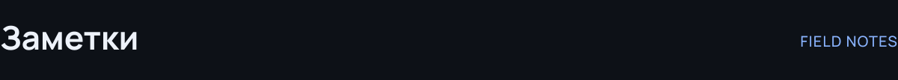</picture></h2>

Коротко о вещах, которые важны в разработке.

<a href="https://github.com/danielmanzuckerberg-tech/danielmanzuckerberg-tech/blob/main/articles/otp-bez-oshibok.md"><picture><source media="(max-width: 640px)" srcset="./assets/article-otp-bez-oshibok-mobile.svg" />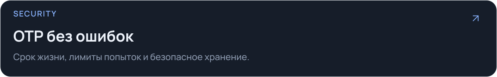</picture></a>

<a href="https://github.com/danielmanzuckerberg-tech/danielmanzuckerberg-tech/blob/main/articles/sms-servis-kotoryj-ne-teryaet-soobscheniya.md"><picture><source media="(max-width: 640px)" srcset="./assets/article-sms-servis-kotoryj-ne-teryaet-soobscheniya-mobile.svg" />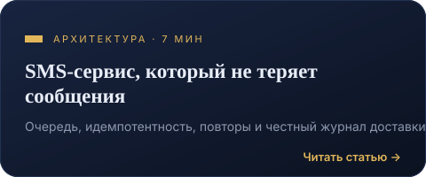</picture></a>

<a href="https://github.com/danielmanzuckerberg-tech/danielmanzuckerberg-tech/blob/main/articles/proxy-dlya-razrabotchika.md"><picture><source media="(max-width: 640px)" srcset="./assets/article-proxy-dlya-razrabotchika-mobile.svg" />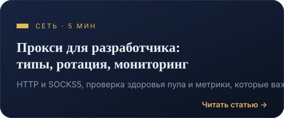</picture></a>

<a href="https://github.com/danielmanzuckerberg-tech/danielmanzuckerberg-tech/blob/main/articles/monitoring-domenov.md"><picture><source media="(max-width: 640px)" srcset="./assets/article-monitoring-domenov-mobile.svg" />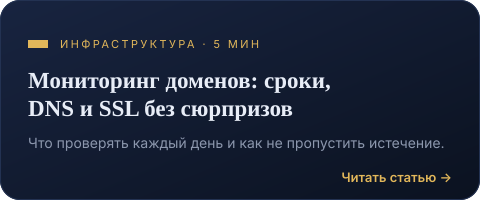</picture></a>

<h2><picture><source media="(max-width: 640px)" srcset="./assets/section-stats-mobile.svg" /></picture></h2>

<b>Статистика и графики GitHub</b> · раскрыть

 

 

Данные предоставляют внешние сервисы; обновление может происходить с задержкой. <a href="https://github.com/danielmanzuckerberg-tech?tab=overview">Посмотреть активность прямо на GitHub →</a>

<h2><picture><source media="(max-width: 640px)" srcset="./assets/section-contact-mobile.svg" />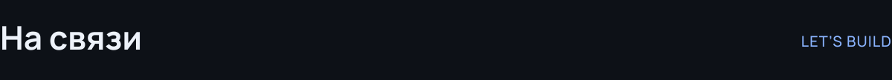</picture></h2>

<a href="https://github.com/danielmanzuckerberg-tech/danielmanzuckerberg-tech/issues/new"><picture><source media="(max-width: 640px)" srcset="./assets/contact-mobile.svg" /></picture></a>

<a href="https://github.com/danielmanzuckerberg-tech">GitHub</a> &nbsp; / &nbsp; <a href="https://github.com/danielmanzuckerberg-tech?tab=repositories">Репозитории</a> &nbsp; / &nbsp; <a href="https://github.com/danielmanzuckerberg-tech/danielmanzuckerberg-tech/tree/main/articles">Заметки</a>

MORITZ · Code. Dream. Set sail. One Piece inspired. Неофициальный фан-дизайн.

